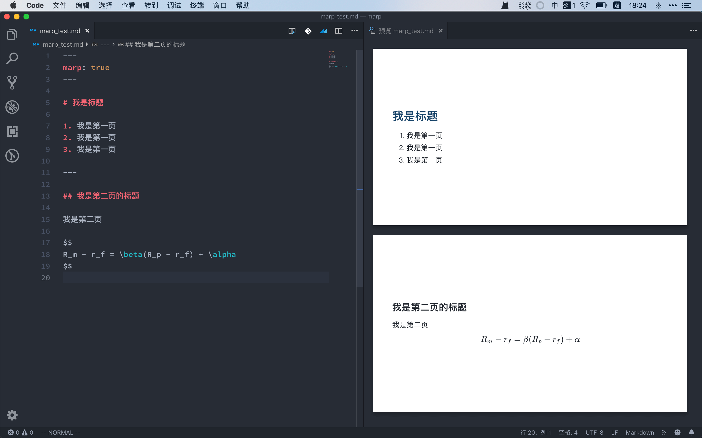
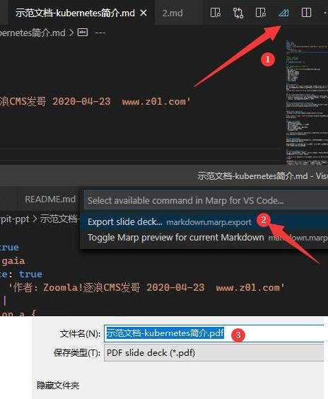
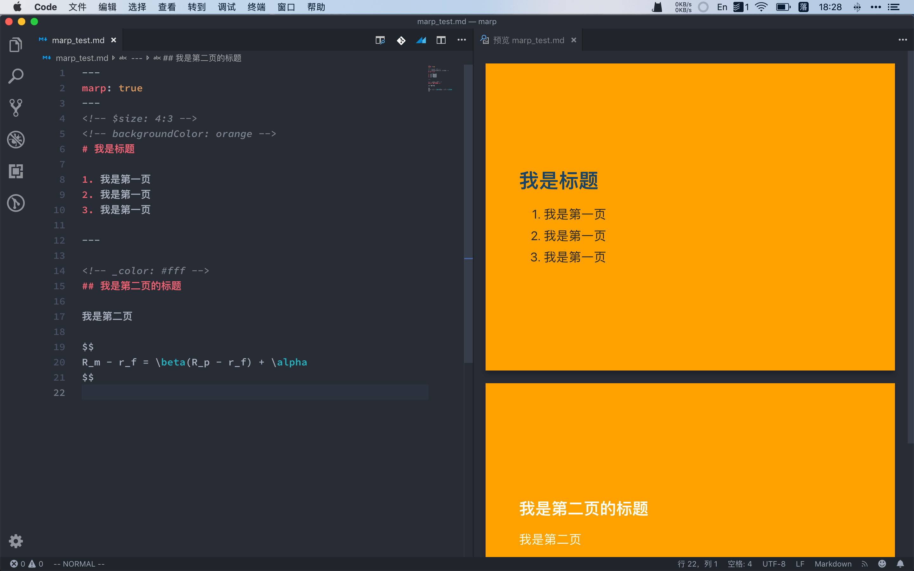
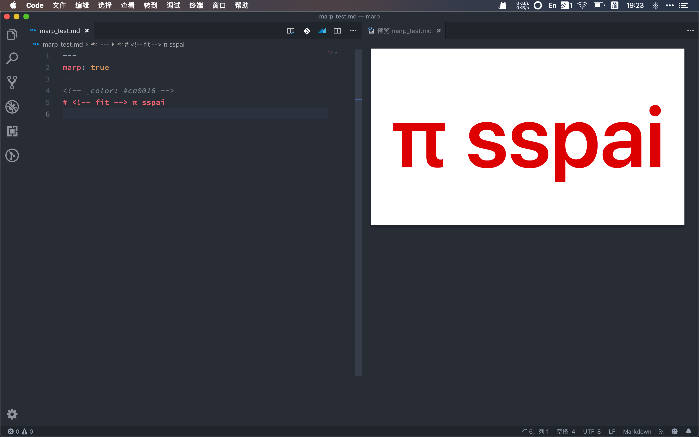
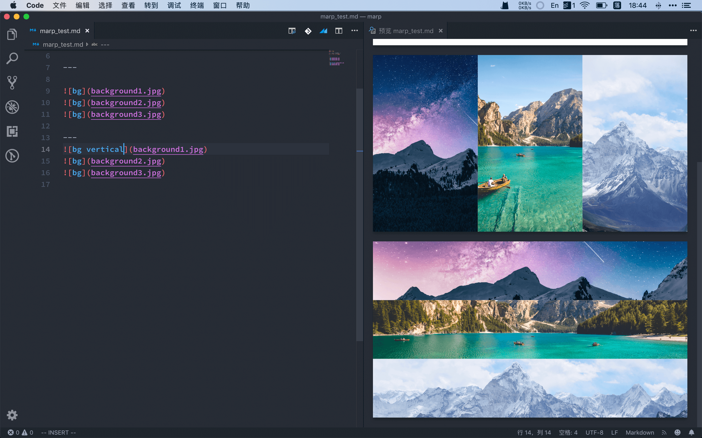
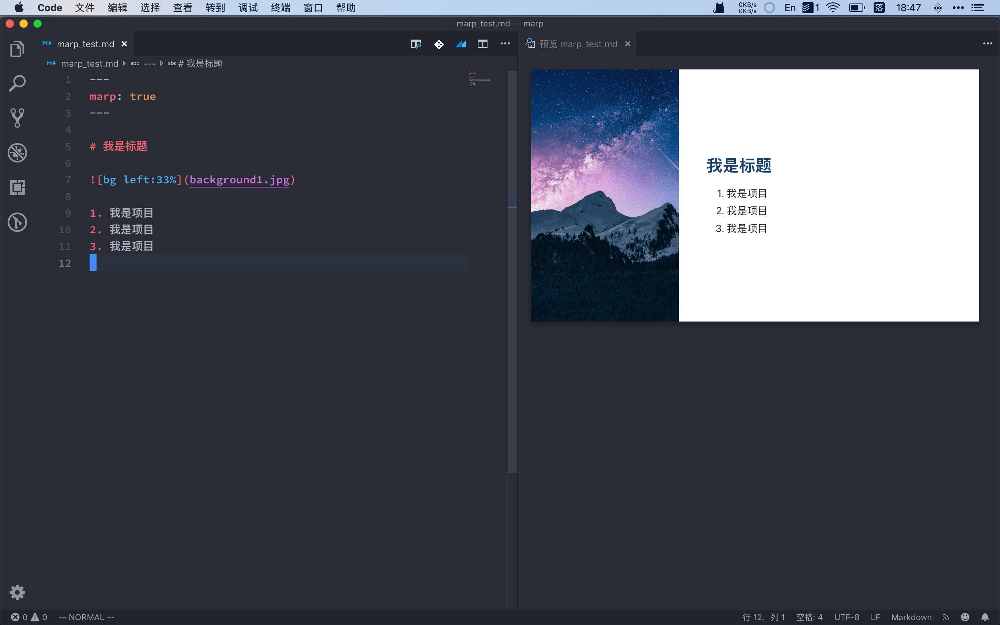

---
文章标题:	Marp工具：一种基于Markdown「写」PPT 的新方法
关键字 :	markdown,ppt,工具,方法
文章分类:	技巧
创建时间:	2020/6/22
---

<!-- TOC -->

- [Marp工具：一种基于Markdown「写」PPT 的新方法](#marp工具一种基于markdown写ppt-的新方法)
    - [无处不在的PPT](#无处不在的ppt)
    - [示范文档：](#示范文档)
    - [安装与上手](#安装与上手)
    - [进阶设置](#进阶设置)
        - [样式命令](#样式命令)
        - [针对图片的特殊设置](#针对图片的特殊设置)
        - [更改长宽](#更改长宽)
        - [图片滤镜（Image Filter）](#图片滤镜image-filter)
        - [背景图片](#背景图片)
        - [设置多背景拼接](#设置多背景拼接)
        - [更多进阶设置](#更多进阶设置)
    - [尾巴](#尾巴)
    - [关联阅读：](#关联阅读)

<!-- /TOC -->

# Marp工具：一种基于Markdown「写」PPT 的新方法


## 无处不在的PPT

对于学生党和上班族来说，演讲、报告、展示几乎已经是家常便饭。在快速展示自己想法的时候，PPT 则能帮助听众迅速捕捉要点，为我们的演讲过程增分不少。

但 PPT 的制作流程就不像观看 PPT 那么容易了，即便是简单的课堂讨论或是轻松的内部交流，一份内容不多的 PPT 做起来也得费上一番工夫。类似这样对 PPT 的设计和细节要求不多的场合，有没有一种快速、简洁的方法迅速完成一份 PPT 呢？

简洁易用的 Markdown 自然会成为很有吸引力的选择。

在少数派以往的文章中其实已经有介绍如何使用 Markdown 制作幻灯片的方法，但这些方法有的需要在 HTML 文档中添加元素，有的则依赖 Python 环境，安装配置相对复杂。几番周折，我终于找到了一个仅需要简单的 Markdown 文档就可以生成幻灯片的工具，也就是我们今天的主角——Marp。

## 示范文档：

作者发哥在这里建了一个示范文档：
https://github.com/zoomla/marpit-ppt/blob/master/%E7%A4%BA%E8%8C%83%E6%96%87%E6%A1%A3-kubernetes%E7%AE%80%E4%BB%8B.md

你可以在这直接下载使用，测试体验。


## 安装与上手
Marp 最早是一个 GitHub 上的开源桌面软件，目前已经迭代成为一个多项目库的集合，包括 JavaScript 框架、命令行接口、代码编辑器插件等等。

对于普通用户而言，现阶段使用 Marp 的最好方式就是通过其发布的 VS Code 插件，通过它，我们可以让使用 Markdown 写 PPT 这件事的体验接近原生 App，上手简单，最后却能输出样式丰富的幻灯片（比如官方的 这个例子）。

我们可以先前往 VSCode 的网站 下载并安装 VSCode 本体，然后在左侧的插件栏中搜索并安装 `Marp for VS Code`。为了获得更好的 Markdown 编辑体验，大家不妨再安装一个叫做 `Markdown All in One` 的插件(当然也可以是其它的Markdown解析插件），然后就可以开始愉快地使用 Marp 了。

使用 Markdown 输出一份最简单的幻灯片，只需要让编辑器知道两点即可：它是幻灯片（不是文档）以及它该在哪里分页。前者只需要在文档的最开头添加如下命令（本质上是 YAML 语法，注意使用 --- 将头部命令部分框起来）：

```
---
marp: true
---
```


后者在 Marp 中则是通过使用分割线语法 ```---``` 来实现的（其上一行需要留作空行）。

同时，在编辑 Markdown 文件时，我们可以打开实时预览来观察生成的幻灯片效果，方便进行样式调整。Marp 插件目前还支持 VS Code 的大纲视图、按页折叠 Markdown 代码块以及造福学生党的 MathJax 公式渲染等等特性。

需要注意的是，无序列表语法 `* `被保留为放映幻灯片时会按元素依次显示列表内容，`-` 与 `+` 可同时显示所有内容；类似的，有序列表语法 `1) `被保留为依次显示列表元素，`1.` 为同时显示所有元素。




编辑完成后，通过编辑器右上角的 Marp 图标按钮就可以调出 `Export slide deck` 命令并导出幻灯片了。Marp 插件目前支持导出 HTML 和 PDF 格式，另外可以将首页导出为 PNG 或 JPEG 格式的图片。




需要注意的是，目前导出 PDF 或者图片时需要依赖 Chromium 内核的浏览器。最终的导出效果与预览时看到的相同。

## 进阶设置

### 样式命令
单纯使用 Markdown 文档输出的幻灯片格式其实是非常朴素的，如果这些简单的样式不能满足你，Marp 还提供了可以自定义元素样式的特殊命令（官方称为 directive）。

这些命令可以通过两种方式完成，一是通过在文件头部的 YAML 命令区输入命令键值对，如

```
---
marp: true
size: 4:3
theme: default
---
```


另一种方式是通过类似 HTML 备注的样式 `<!-- directive: value -->` 完成，如在文件中添加 `<!-- size: 4:3 -->` 同样可以更改幻灯片的比例。使用第二种方式写命令时，该命令默认对当前与其后所有的幻灯片生效。

若想改变这一方式，可以在命令前加一个 $ 使其针对整个文档有效，或在前面加一个下划线_ 使其仅对当前一张幻灯片生效。如使用 `<!-- $backgroundColor: orange -->` 将更改全文的背景，使用` <!--_backgroundColor: orange -->` 将仅改变本张幻灯片的背景颜色。



Marp 支持的命令还算丰富，包括主题 `theme` 、长宽比 `size`、是否显示页码 `paginate`、页眉 `header`、页脚 `footer`、背景设置 `backgroundColor` 、`backgroundImage` 和文字颜色 `color` 等等。更多命令在 官方说明页 上有详细的解释。

这里单独说明一下控制是否使用标题级别直接作为分页标志的全局命令 headingDivider。如果 Markdown 文档本身层级组织较好，可以将它设置为 ture 并且不用再通过分割线为幻灯片分页，在输出幻灯的同时也能保证输出 Markdown 文档时不会因为出现大量的分割线影响效果。

此外，Marp 还保留了一个 `<!-- fit -->` 命令用于标题的自适应，将它放在Markdown 标题的 # 后可以使得标题自动填充幻灯片的大小，比较适合于首页大标题等场景。



### 针对图片的特殊设置
为了使放入幻灯片中的图片看起来更美观，我们需要对它进行一些大小、格式或细节上的调整。对此，Marp 使用了在原生的 Markdown 图片语法的基础上进行了拓展，可以直接在Markdown 语法中控制图片的表现形式，一般形式为 ``

### 更改长宽
对于背景图片，更改图片长或宽可以使用关键词 width、height 或简称为 w 和 h
```


```


### 图片滤镜（Image Filter）
基于 CSS 的 filter 属性，Marp 可以对图片进行一些基于模糊、亮度、对比度等的操作，如：
```


```

### 背景图片
针对幻灯片的背景图片，Marp 提供了简单的方式将某张图片设为背景，在方括号中写入 bg 即可
```


```

同时通过在bg 后追加图片的格式属性，如 [bg fit]，可以具体设置背景图片的缩放方式。其中 cover 表示充满页面，fit 表示拉伸以适应页面，auto 为不做缩放使用原图片比例。

更为进阶的背景图片设置需要开启官方提供的所谓 Inline SVG 实验功能，该功能支持多背景图片组合与单侧背景图片的进阶使用方式。在文档中使用输入多个背景图片后，图片将默认横向排列开来。
```


```

同时，在其中一张图片后加入属性 vertical 将使图片纵向组合。

### 设置多背景拼接
如果想将背景图片固定在幻灯的单侧，在 bg 后加入属性 left 或 right，该图片将占据左或右 50% 的空间，并将另外的 50% 留给正文内容。同时，可以在属性后再追加比例值控制图片占幻灯的比例大小，如 [bg left:33%]。


同时，以上所有的图片属性也可以一起使用（比如 [bg left:33% blur:10px brightness:90%]）从而帮助你做出更美观的幻灯片。更详细的说明与图片属性依然建议参见官方的说明文档。


### 更多进阶设置
如果官方提供的主题和命令接口依然不能满足你的需求，你可以直接使用自定义的 css 文件，或者直接使用 JS 框架进行更多可能的修改。Marp 还是一个正在开发中的项目，相信未来也会提供更多的新功能满足更多样化的需求。

官方目前有三种主题样式default、gaia、uncover可供选择。

## 尾巴
制作 PPT 本身依然是个兼具设计、美术和排版等技术的复杂工作，不过在一些场景下，我们可以借助一些轻量的工具快速地制作幻灯片来交流想法，为其他主要事务留出时间。

在这些情况下，使用 Markdown 不失为一种很好的方式，而 Marp 在将Markdown 文档转换为幻灯的同时又兼具一定的排版能力，满足了前述的轻量使用场景。临时遇到需要赶制 PPT 的情况，也不用为简单的 PPT 制作熬夜头秃了！

## 关联阅读：

Reveal.js：把你的 Markdown 文稿变成 PPT https://sspai.com/post/40657
如何用 Markdown 做幻灯？ https://sspai.com/post/52589

本项目的Github示范库：
https://github.com/zoomla/marpit-ppt